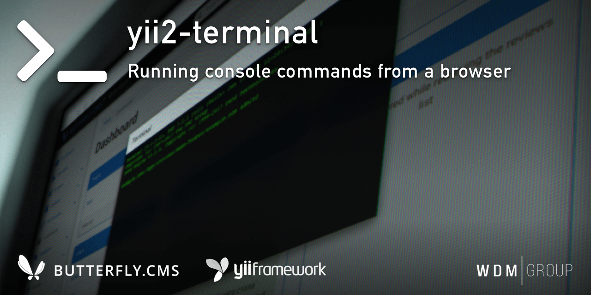

# Yii2 Terminal
Running console commands from a browser.

This module is an integral part of the [Butterfly.СMS](https://butterflycms.com/) content management system, but can also be used as an standalone extension.

Copyrights (c) 2019-2023 [W.D.M.Group, Ukraine](https://wdmg.com.ua/)

# Usecase
Use the `--` prefix to pass arguments at the command time and a space as the argument / value separator.
For example:
    
    $ php yii admin/init --choice 1

# Requirements 
* PHP 5.6 or higher
* Yii2 v.2.0.35 and newest
* [Yii2 Base](https://github.com/wdmg/yii2-base) module (required)
* [jQuery Terminal Emulator](https://github.com/jcubic/jquery.terminal) (required)
* [jQuery UI](https://github.com/components/jqueryui) (required)

# Status and version [ready to use]
* v.1.3.1 - Fix npm dependencies, assets
* v.1.3.0 - Update copyrights, fix nav menu
* v.1.2.0 - CLI disabled by default. Bugfix, update dependencies